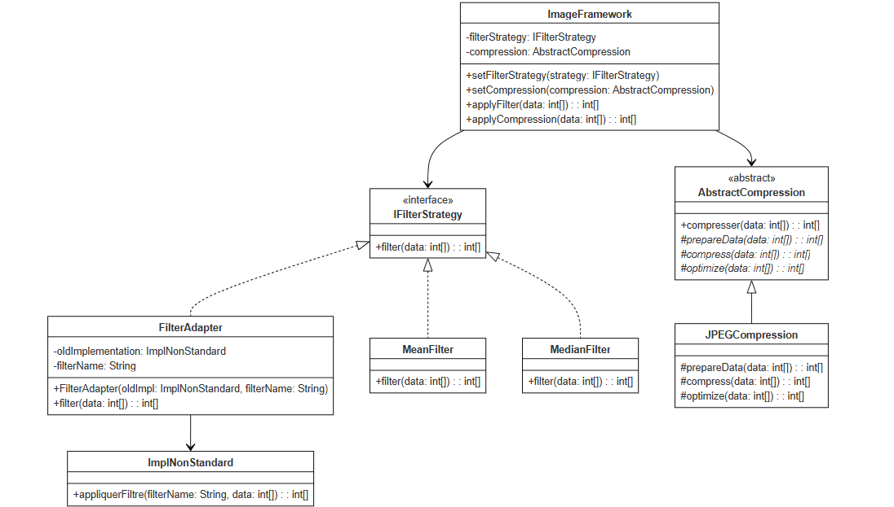

# Exercice Design Patterns - Framework de Traitement d'Images

## Description de l'exercice
Implémentation d'un framework de traitement d'images pour pratiquer l'utilisation des Design Patterns. L'exercice se concentre sur l'application des patterns Strategy, Adapter et Template Method.

## Objectifs pédagogiques
- Comprendre et implémenter les Design Patterns
- Appliquer les principes SOLID
- Pratiquer la conception orientée objet

## Structure du projet

### Design Patterns utilisés

1. **Pattern Strategy**
    - Permet de changer dynamiquement l'algorithme de filtrage
    - Interface `IFilterStrategy`
    - Implémentations : `MeanFilter`, `MedianFilter`

2. **Pattern Adapter**
    - Adapte l'ancienne implémentation `ImplNonStandard`
    - Classe `FilterAdapter`

3. **Pattern Template Method**
    - Définit le squelette de l'algorithme de compression
    - Classe abstraite `AbstractCompression`
    - Implémentation : `JPEGCompression`

## Consignes de l'exercice

### Question 1
Établir le diagramme de classes du Framework en appliquant les design patterns appropriés.

### Question 2
Écrire une implémentation Java du Framework.

### Question 3
Écrire le code d'une application qui utilise ce Framework en permettant à l'utilisateur de saisir le nom des classes d'implémentation.

## Critères à respecter
- Framework fermé à la modification et ouvert à l'extension
- Possibilité d'évolution des opérations de filtrage
- Changement dynamique de l'implémentation du filtrage
- Adaptation d'anciennes implémentations
- Définition du squelette de l'algorithme de compression

---
*Cet exercice est conçu pour l'apprentissage et la pratique des Design Patterns en Java.*